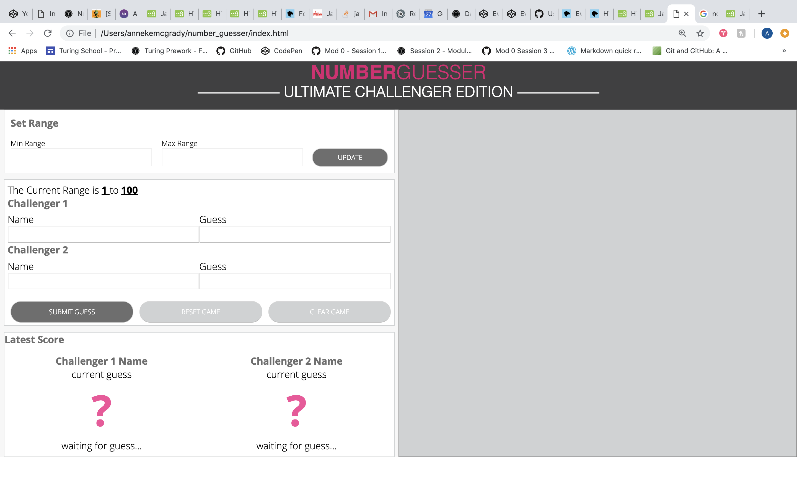

#Number Guesser Project
##Anneke McGrady & Jon O'Drobinak

The purpose of this project was to recreate a website game per a comp provided.   The objective of the game is for two players to guess the random number between 1 and 100 and give the players the option to change the range if they want. Current players and guesses should display at the bottom with appropriate message about their guess.  When a player wins by guessing the random number a winner card appears on the right side of the screen with both player names, and the winner.  The site should also be responsive for both desktop and mobile layouts.  The comp included four phases of functionality with increasing difficulty of execution.

